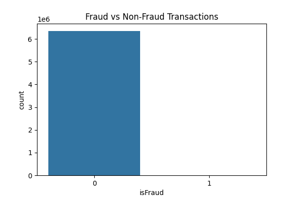
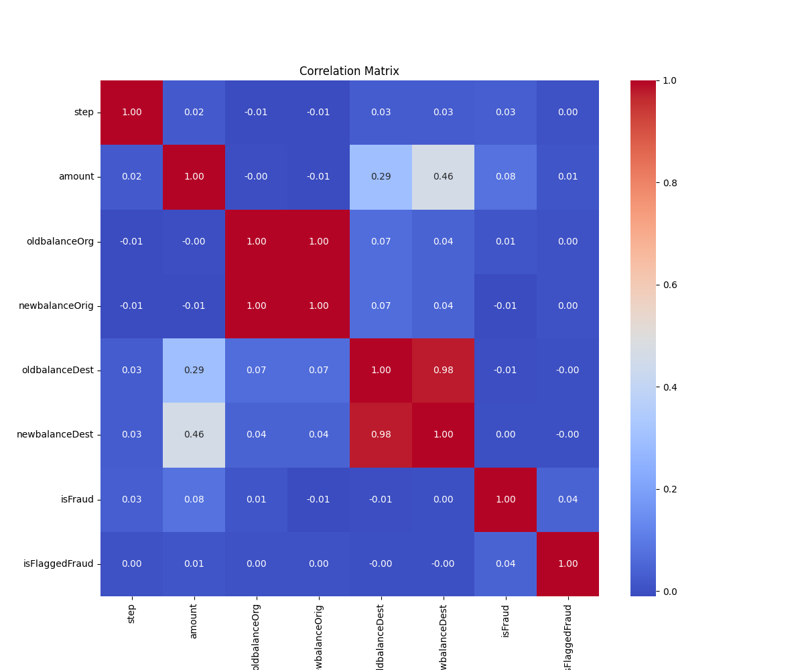
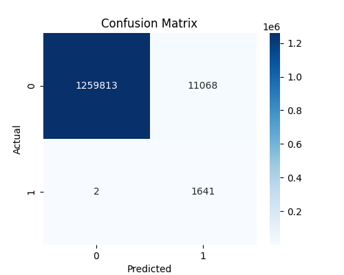
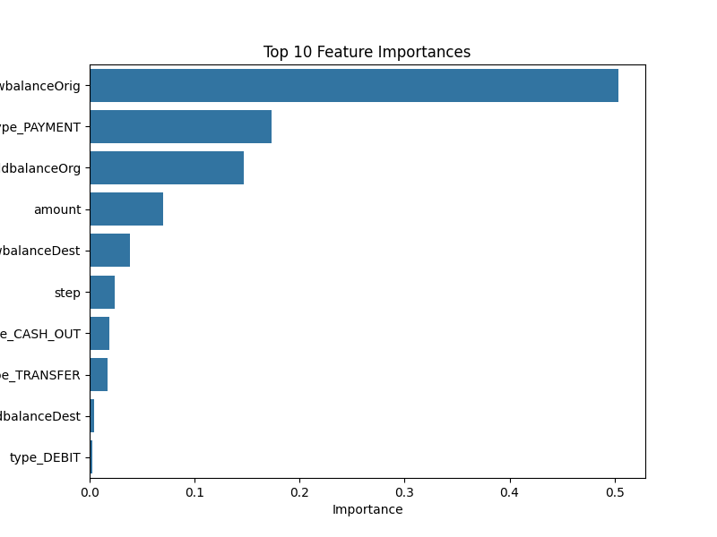
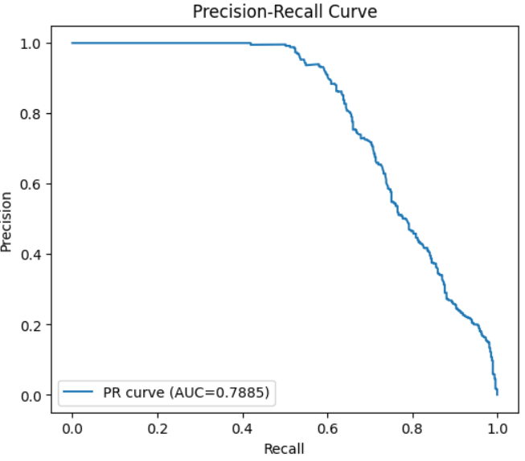

# Fraud-Detection-Project

## Project Overview
This project focuses on developing a machine learning model to detect fraudulent transactions in a large financial dataset (~6.3 million records). The objective is to build a model that can identify suspicious activity, minimize false positives, and provide actionable insights for prevention strategies.

The workflow covers:
- Data cleaning and preprocessing
- Exploratory data analysis (EDA)
- Feature engineering and selection
- Model training and evaluation
- Interpretation and actionable recommendations

---

## Table of Contents
1. [Dataset Description](#dataset-description)  
2. [Objectives](#objectives)  
3. [Exploratory Data Analysis](#exploratory-data-analysis)  
4. [Data Preprocessing](#data-preprocessing)  
5. [Feature Engineering](#feature-engineering)  
6. [Model Development](#model-development)  
7. [Model Evaluation](#model-evaluation)  
8. [Key Findings](#key-findings)  
9. [Prevention Measures & Monitoring](#prevention-measures--monitoring)  
10. [Outputs & Results](#outputs--results)  
11. [How to Run](#how-to-run)  
12. [Acknowledgements](#acknowledgements)

---

## Dataset Description
The dataset contains transaction records for 30 days (744 hourly steps), with the following key columns:  
- `step`: Time step (1 step = 1 hour)  
- `type`: Transaction type (`CASH-IN`, `CASH-OUT`, `DEBIT`, `PAYMENT`, `TRANSFER`)  
- `amount`: Transaction amount in local currency  
- `nameOrig` / `nameDest`: Sender and recipient accounts  
- `oldbalanceOrg` / `newbalanceOrig`: Sender balances before and after transaction  
- `oldbalanceDest` / `newbalanceDest`: Recipient balances (not available for merchants)  
- `isFraud`: Target variable indicating fraudulent transactions  
- `isFlaggedFraud`: Flags illegal transfers >200,000  

**Data Source:** 

You can access the project dataset here: [Dataset](https://drive.google.com/uc?export=download&id=1VNpyNkGxHdskfdTNRSjjyNa5qC9u0JyV)


---

## Objectives
- Identify fraudulent transactions in real-time using machine learning.  
- Understand key factors that predict fraud.  
- Provide actionable recommendations for preventing fraud.  

---

## Exploratory Data Analysis
Key visualizations generated during EDA:

1. **Fraud vs Non-Fraud Transactions:**  
   

2. **Correlation Matrix:**  
   

---

## Data Preprocessing
- Missing values imputed for numeric (median) and categorical (mode) columns.  
- Outliers removed using IQR method (except for critical columns like `amount` and `isFraud`).  
- Categorical features encoded (one-hot).  
- Numeric features scaled for consistency (optional for tree-based models).  

---

## Feature Engineering
- Non-predictive columns dropped: `nameOrig`, `nameDest`, `isFlaggedFraud`.  
- Key engineered features: `transaction type` encoding, balance difference calculations.  
- Top predictive features selected based on domain knowledge and correlation analysis.  

---

## Model Development
- **Model Used:** XGBoost Classifier (gradient boosting decision trees)  
- **Hyperparameters:**  
  - `n_estimators=100`  
  - `max_depth=5`  
  - `learning_rate=0.1`  
  - `scale_pos_weight` for handling class imbalance  
- **Training Method:** Stratified train-test split (80-20) to maintain fraud ratio.  

---

## Model Evaluation

- **Classification Report:** Precision, Recall, F1-score for fraud detection.  
- **ROC-AUC Score:** Measures the model's ability to distinguish between classes.  
- **Confusion Matrix:**  
  

- **Top 10 Feature Importances:**  
  
  
-  **Precision-Recall Curve & PR-AUC:**
  
   
---

## Key Findings

- **Top Predictors of Fraud:**  
  - `amount`, `oldbalanceOrg`, `newbalanceOrig`  
  - `type_TRANSFER`, `type_CASH_OUT`  
- These features align with real-world patterns: large transfers, rapid balance depletion, and specific transaction types indicate higher risk.  

---

## Prevention Measures & Monitoring

- Implement **real-time transaction monitoring** and alerts.  
- Set **threshold-based controls** for large transactions.  
- Retrain models periodically to capture evolving fraud patterns.  
- Track KPIs: fraud detection rate, false positives, precision, recall, and conduct pre-post analysis.  
- Use A/B testing to validate the effectiveness of preventive actions.

---

## Outputs & Results
All outputs are saved in the `outputs/` folder:  
- `fraud_distribution.png` – Fraud vs Non-Fraud counts  
- `correlation_matrix.png` – Feature correlations  
- `confusion_matrix.png` – Model predictions vs actual  
- `feature_importance.png` – Top predictive features  
- `xgb_fraud_model.pkl` – Trained XGBoost model  
-  `precision_recall_curve.png` –  Precision vs Recall
---

## How to Run
1. Clone the repository:  
   ```bash
   git clone <repo-url>
   cd <repo-folder>

2. Install dependencies:
   ```bash
   pip install -r requirements.txt


3. Open the Jupyter Notebook:
     ```bash
     jupyter notebook Fraud_Detection.ipynb


4. Check the outputs/ folder for generated images, model, and README.md file.

## Acknowledgements

- ACCREDIAN assignment dataset

- Libraries: pandas, numpy, matplotlib, seaborn, scikit-learn, xgboost

- Inspired by best practices for fraud detection in financial institutions
